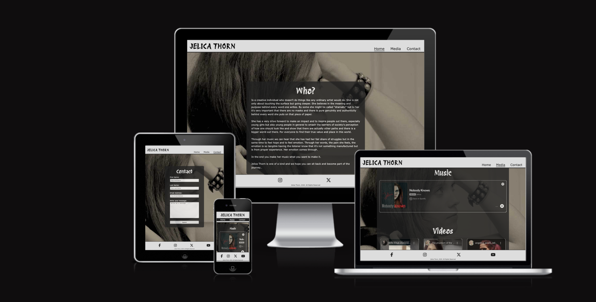
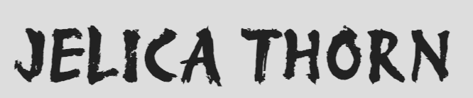
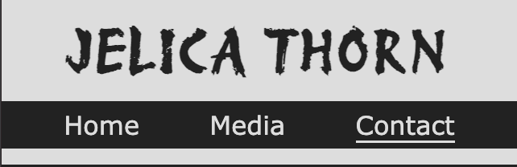
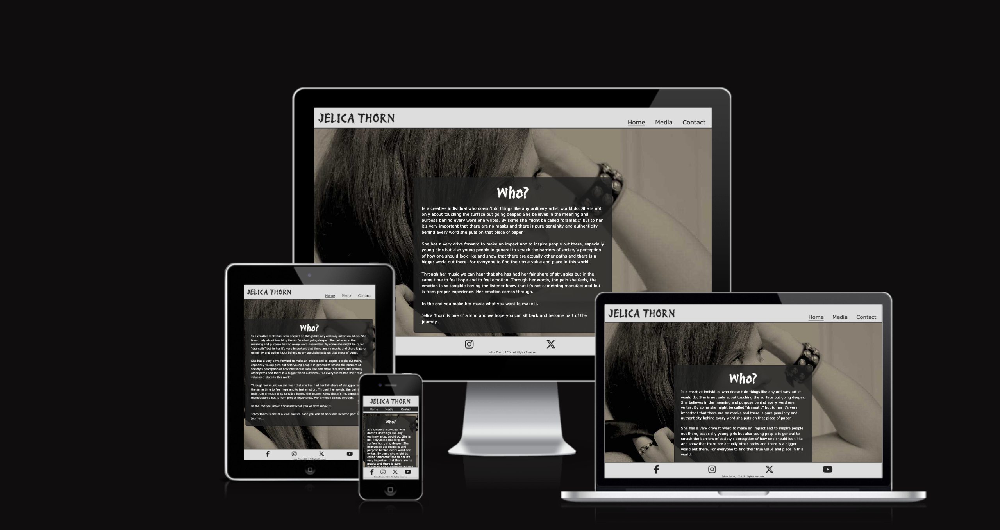

# Jelica Thorn Music

This is a website for Jelica Thorn Music. This website is reponsive and allowed to view on all devices. The purpose of building this website is to attract mroe followers and listeners. To extend her brand and hopefully inspire people with her music.

You can reach the page link [here](https://andreasawenlof.github.io/pp1-final/)
---

## CONTENTS

- [Jelica Thorn Music](#jelica-thorn-music)
  - [You can reach the page link here](#you-can-reach-the-page-link-here)
  - [CONTENTS](#contents)
  - [User Experience (UX)](#user-experience-ux)
    - [Key information for the site](#key-information-for-the-site)
    - [User Stories](#user-stories)
      - [Client Goals](#client-goals)
      - [First Time Visitor Goals](#first-time-visitor-goals)
      - [Returning Visitors Goals](#returning-visitors-goals)
  - [Design](#design)
    - [Colour Scheme](#colour-scheme)
    - [Thoughts behind choosing this colour scheme:](#thoughts-behind-choosing-this-colour-scheme)
    - [Typography](#typography)
      - [Protest Revolution](#protest-revolution)
    - [Imagery](#imagery)
    - [Wireframes](#wireframes)
  - [Features](#features)
    - [General features on each page](#general-features-on-each-page)
    - [Favicon](#favicon)
    - [Header / Nav](#header--nav)
      - [Mobile](#mobile)
      - [Desktop](#desktop)
    - [Footer](#footer)
    - [The Homepage](#the-homepage)
    - [Media Section](#media-section)
    - [Contact Section](#contact-section)
    - [404 Error Page](#404-error-page)
    - [Future Implementations](#future-implementations)
    - [Accessibility](#accessibility)
    - [Languages Used](#languages-used)
    - [Frameworks, Libraries \& Programs Used](#frameworks-libraries--programs-used)
  - [Deployment \& Local Development](#deployment--local-development)
    - [Deployment](#deployment)
    - [Local Development](#local-development)
      - [How to Fork](#how-to-fork)
      - [How to Clone](#how-to-clone)
  - [Testing](#testing)
  - [Credits](#credits)
    - [Code Used](#code-used)
    - [Content](#content)
    - [ Media](#media)
      - [Used Media](#used-media)
    - [ Acknowledgments](#acknowledgments)
  - [Final Thoughts and Comments](#final-thoughts-and-comments)
  - [GENERAL EXPERIENCE](#general-experience)

---

## User Experience (UX)

Jelica Thorn Music is a music site of the musician and artist Jelica Thorn. Where people can listen and be part of her journey. People can listen to her music, view her videos and even contact her through the contact form.

### Key information for the site
 - Listen to music
 - Watch Videos
 - Relate to her story
 - Contact her

### User Stories

#### Client Goals

- To view the site on a range of different devices
- To understand what the artist is about
- To be able to listen to music
- To relate and become a follower of her journey
- To have clear links and no confusion where to go

#### First Time Visitor Goals

- I want to know what the artist is about and through that know if i'm interested or not
- I want to be able to listen or watch the artist media either on the site or being able to click external links that can open in a new tab
- I want to be able to contact the artist or send them a message

#### Returning Visitors Goals
- I want to see updates of new releases
- I want to be able to contact her or send a message
- I want to still be able to relate and recognize myself as last time

## Design

### Colour Scheme

### Thoughts behind choosing this colour scheme:
Grayscale will never be outdated. It has a retro feel but also an intimate feel. It's timeless like this artist. Color scheme also show truth and genuinity, what you see is what you get. This colour-scheme reflects the artist the best.

### Typography
I only imported one font from googlefonts that i use for the logo and h2 describing sections of the site.

#### Protest Revolution
Reason behind this font is it felt a bit rebellish and a bit outside the box reflecting the artist and their personality and art.

It is accessible through google fonts, but i don't think it's that common.

Otherwise the fonts i've used are standard:
Verdana

### Imagery

Using one background image for all content:

### Wireframes
Wireframes were not used for this particular project

## Features
The page consist a home-page, media section, contact section and 404 Error page.

The whole site is reponsive and works well for all kind of different devices.

👩🏻‍💻 View an example of a completed user experience section [here](https://github.com/kera-cudmore/TheQuizArms#Features)

This section can be used to explain what pages your site is made up of.

### General features on each page

### Favicon
 that represents that it's a music page and more an artist, singer page.

Favicon exists on every page.

### Header / Nav

This header exist on every page:

#### Mobile

Header for mobile is a bit different. Logo on top centered to easily see the artist anem.
The navigation links is inside the header and contrast with a darker background and lighter text color to make it clear and visible.
The header is fixed and doesn't follow the flow of the rest of the page.

#### Desktop

Consists of the logo (artist name) which also is a link to back to the homepage and a menu to the right to easily navigate to different pages.
The links changes color when hovering to easily know what you're mouse is pointing over. 
An active feature is added as an underline under the link to easily see what page you're on.
The header is fixed and doesn't follow the flow of the rest of the page.

### Footer

The footer exists on every page

Footer with social-link-icons to easy visit social-media links of the artist. The links opens in a new tab. Copyright information in the bottom center.
Used the same colors for footer as for header to make it follow a consistent theme.
The footer is fixed and doesn't follow the flow of the rest of the page.

Footer with social-link-icons to easy visit social-media links of the artist. The links opens in a new tab. 
The links also has a hover effect when having your mouse pointer of the links in the same color as the header links for consistent colors with the overall theme. 
Copyright information in the bottom center.
Used the same colors for footer as for header to make it follow a consistent theme.
The footer is fixed and doesn't follow the flow of the rest of the page.

Background is fixed, and all the content in front of it moves without the background moving.

### The Homepage
The homepage consists of an about me section to read about the artist, what she is about and what her music is inspired. This page is very crucial to attract the visitor as we want them to click further on the links.

### Media Section
This page consist of header and embedded iframes of media. Spotify link and youtube links. The section is split up into 2 sections for clarity:
- Music section
- Video section
The padding is transparent but the videos and the content is not trasnsparent.

### Contact Section
The contact section consist of a h2 header and a form for the visitor to contact the artist.
The input-fields are required which means a user must input information in all fielfs for it to be able to submit.
A large textarea for the user to input a larger message for the communication to feel a bit more personal and intimate.
A bit submit button is added below the form to submit the contact form.

### 404 Error Page
Information when the user inputs a non existing webpage. Alert and information that the page cannot be reached and also a link to take the user back to the homepage.

### Future Implementations
- An update section where there is a "feature-section" like a new album or so. 
- Better source material, better quality and more proper links for the artist to express themselves.
- A Tour-section where visitors can follow the artist and come to their shows.
- An integrated section to maybe instagram or facebook to see latest photos or posts. 

### Accessibility

Semantic HTML have been used for better anc clearer accessibility for scree readers. 
Hover state on links to easier see where the mouse pointer is over.
Underline on desktop version to make sure user knows what page they're currently on.
Colors with enough contrast to see clearly different elements.
Used Sans-Serif fonts for better accessibility to people with dyslexia.

Recognizable icons on social media links so it's easy to navigate and clear to see.
Added aria-labels on all links to help screen-readers better understand and navigate the project.
Passed contrast checker, had one problem it said but it's only them not understandin the media querys.

### Languages Used
HTML and CSS were used to create this website. 
VERY little javascript just so the fontawesome icons could be loaded.

### Frameworks, Libraries & Programs Used
Git - For version control
Github - To save and store files for the website
Googlefonts - For being able to use the font of the Logo and h2 headers.
Fontawesome - For the social-media icons in the footer.
Favicons - To find the favicon used.

## Deployment & Local Development
The site is deployed using Github Pages - [Jelica Thorn Music](https://andreasawenlof.github.io/pp1-final/)

👩🏻‍💻 View an example of a completed Deployment & Local Development section [here](https://github.com/kera-cudmore/TheQuizArms#Deployment)

### Deployment
The instructions to achieve this are below:
1. Log in (or sign up) to Github.
2. Find the repository for this project, pp1-final.
3. Click on the Settings link.
4. Click on the Pages link in the left hand side navigation bar.
5. In the Source section, choose main from the drop down select branch menu. Select Root from the drop down select folder menu.
6. Click Save. Your live Github Pages site is now deployed at the URL shown.

### Local Development
If you use VSCode here are the instructions:
1. Click on this icon    to go to extensions.
2. Search for "Live Server".
3. Click Install
4. When installed you might need to restart VSCode.
5. When inside the project you see in the bottom right corner "Go Live".
6. Click on that and the page will open up locally in you browser.
7. This will update in realtime when you make changes in the project on VSCode.

#### How to Fork
How to Fork
To fork the Bully-Book-Club repository:

Log in (or sign up) to Github.
Go to the repository for this project, andreasawenlof/pp1-final.
Click the Fork button in the top right corner.
How to Clone
To clone the pp1-final repository:

#### How to Clone
Log in (or sign up) to GitHub.
Go to the repository for this project, andreasawenlof/pp1-final.
Click on the code button, select whether you would like to clone with HTTPS, SSH or GitHub CLI and copy the link shown.
Open the terminal in your code editor and change the current working directory to the location you want to use for the cloned directory.
Type 'git clone' into the terminal and then paste the link you copied in step 3. Press enter.

## Testing
See attached [TESTING.md](TESTING.md)

## Credits

👩🏻‍💻 View an example of a completed Credits section [here](https://github.com/kera-cudmore/BookWorm#Credits)

The Credits section is where you can credit all the people and sources you used throughout your project.

- https://spotify.com
- https://www.tutorialspoint.com/how-to-add-multiple-font-files-for-the-same-font-using-css
- https://blog.hubspot.com/website/musician-website-examples

### Code Used

I've gotten inspired from the love-runnin project but wrote all the code myself.
Also used Kera's readme-template to make a readme that i adjusted to fit my project.

### Content
All the content is written by me.

###  Media
#### Used Media
[Spotify Music Link](https://open.spotify.com/track/20Jtrb4hJ3dgCegCf77nxB?si=518ae356d11240e8)
[Video 1](https://youtu.be/uULC0GdkIHw?si=qP7veNjSbxmXEf6t)
[Video 2](https://youtu.be/Hb36psFq-DM?si=Cz8frczt-AjOO-V4)
[Video 3](https://youtu.be/kQH00gQPYOg?si=6e-5dULDCVwJsQgU)
[Video 4](https://youtu.be/2vXI7yokQ2Y?si=6d7zhLGNvSbxJGAV)
[Video 5](https://youtu.be/Tb2r2hlHCa8?si=3oRD4hSn_6SNl6hB)
  
###  Acknowledgments
Thanks to the Swedish Community on slack for being absolute Legends.
Jörgen_5P_Lead
Erik Guldbrand_P5
Emma S-A_5P
Jaqi_5P
Niclas_5P_Lead
And many more if i forgot someone.
Thanks to my sister who is the artist and has giving me right to do this and use her material and resource.
Thanks to my great mentor from CI, that gave me great feedback and pointers so I could fix things very early.
Thanks to CI Academy for providing a great learning experience.
Thanks to Jack Ryan on Amazon Prime for helping me with taking breaks.

## Final Thoughts and Comments
## GENERAL EXPERIENCE
I probably ended up rebuilding the project 10-20 times not being happy. Started with different designs, single page, multi page, single page again. Colors no grayscale etc. The journey has been long but it has been very teachable and fun in the end.
