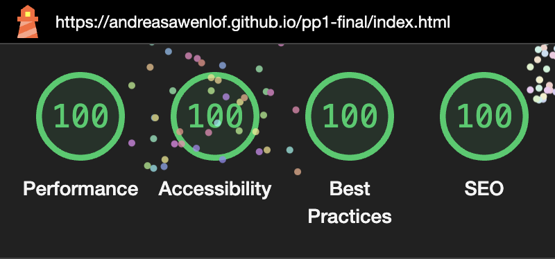
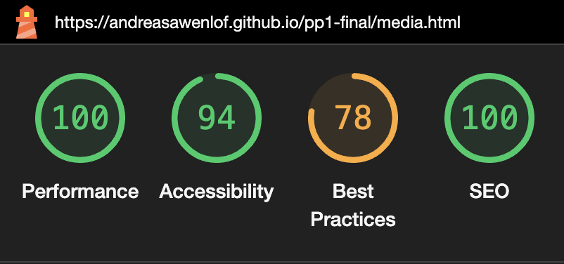
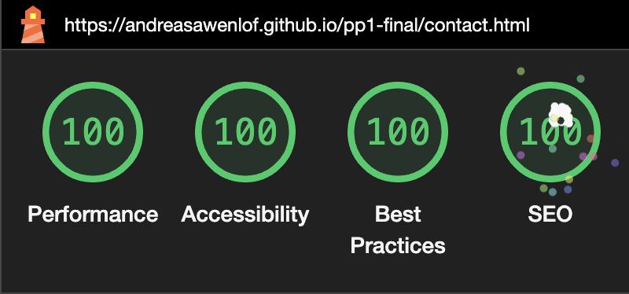
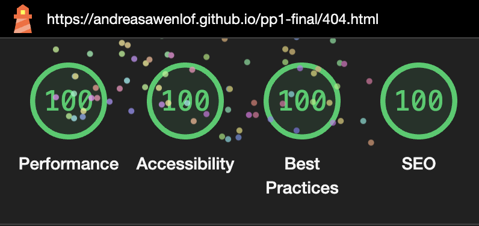
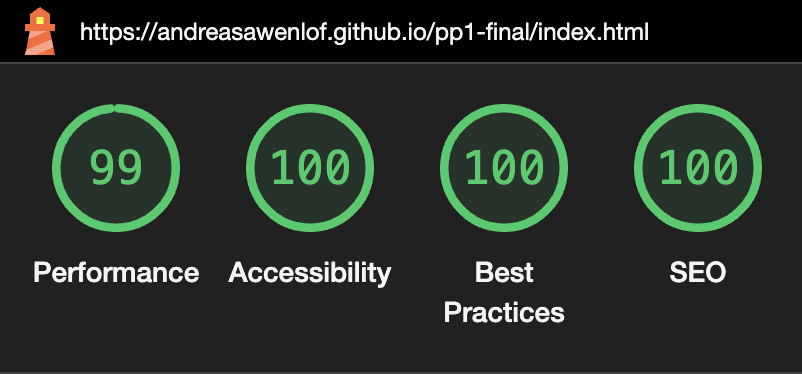
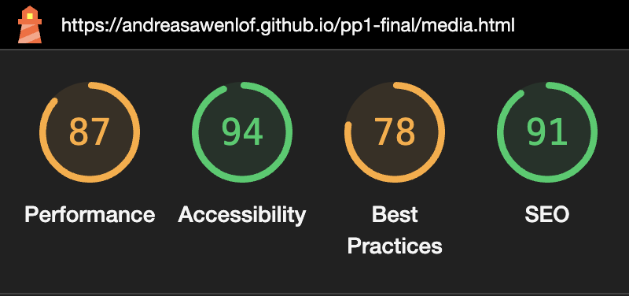
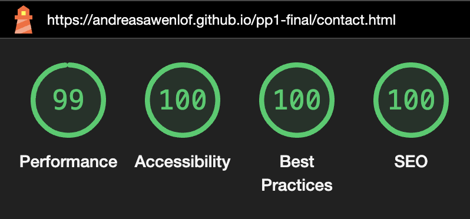
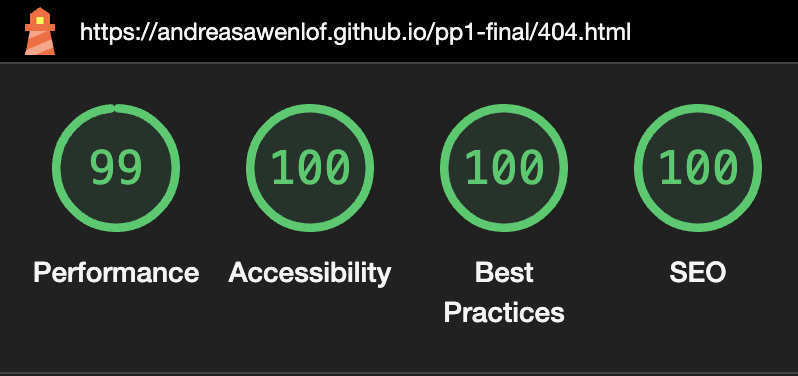

Jelica Thorn Music - TESTING

You can view the page [here](https://andreasawenlof.github.io/pp1-final/)
---

## CONTENTS

- [You can view the page here](#you-can-view-the-page-here)
- [CONTENTS](#contents)
- [AUTOMATED TESTING](#automated-testing)
  - [ W3C Validator](#w3c-validator)
  - [Lighthouse](#lighthouse)
    - [Desktop Results](#desktop-results)
    - [Mobile Results](#mobile-results)
- [MANUAL TESTING](#manual-testing)
  - [Testing User Stories](#testing-user-stories)
    - [Returning Visitors Goals](#returning-visitors-goals)
  - [Full Testing](#full-testing)
- [FIXED AFTER MENTOR FEEDBACK](#fixed-after-mentor-feedback)
- [FIXED AFTER USER FEEDBACK/EXPERIENCE](#fixed-after-user-feedbackexperience)
- [BUGS](#bugs)

---

## AUTOMATED TESTING

###  W3C Validator
[WC3](https://validator.w3.org/) was used to validate all HTML and CSS.
 
[index.html](https://andreasawenlof.github.io/pp1-final/index.html) - passed
 
[media.html](https://andreasawenlof.github.io/pp1-final/media.html) - passed
 
[contact.html](https://andreasawenlof.github.io/pp1-final/contact.html) - passed
 
[404.html](https://andreasawenlof.github.io/pp1-final/404.html) - passed

### Lighthouse

Lighthouse
I used Lighthouse within the Chrome Developer Tools to test the performance, accessibility, best practices and SEO of the website.

#### Desktop Results

#### Mobile Results

## MANUAL TESTING

### Testing User Stories

- I want to know what the artist is about and through that know if i'm interested or not
- I want to be able to listen or watch the artist media either on the site or being able to click external links that can open in a new tab
- I want to be able to contact the artist or send them a message

#### Returning Visitors Goals
- I want to see updates of new releases
- I want to be able to contact her or send a message
- I want to still be able to relate and recognize myself as last time

### Full Testing
Full testing was performed on the following devices:

- Laptop:
  - Macbook Air M2 13,6"
Mobile Devices:
Phone X.

Tested the site using the following browsers:
Google Chrome
Safari
Firefox
Microsoft Edge

Had friends and family testing the site and reported very few issues.

## FIXED AFTER MENTOR FEEDBACK
- Removed transparency on header and footer
- Merged about.html content to be at the home page for better attraction of visitor
- Added more content in media section
- Added Copyright in bottom of footer
- Submit didn't go anywhere, added link to formdump.

## FIXED AFTER USER FEEDBACK/EXPERIENCE
- Split up the media section into Music and Video

## BUGS
| Bug | Fix |
| :--- | :--- |
| Scroll-bar appeared in the "who-section" on Home | Removed "overflow" from style.css. |
| Viewing contact form on Firefox, placeholder was too aligned to the left | Increased the padding-left |
| Background scrolled with the content | Added background-attachment: fixed |
| Everything was transparent even the videos on media section | Instead of Opacity i added an alpha channel to the color and chaged it from HEX to RGBA |

No unsolved bugs.